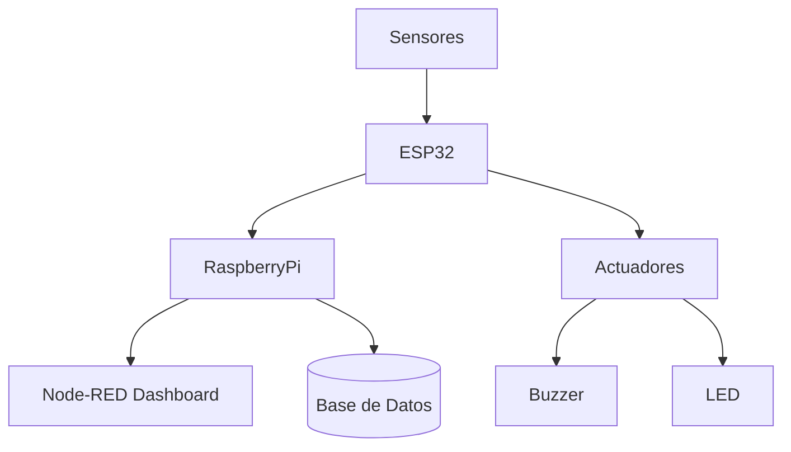

# AppsIoT-ProyectoFinal2025
# 🚨 Sistema Anti-Inundaciones de Sótanos

**Autores:** Gerardo Manzano y equipo  
_Proyecto final de la materia Aplicaciones de IoT_

---

## 🌟 Características Clave

- 📡 **Detección en tiempo real** de gas, sonido y obstáculos.
- 🌦️ **Monitoreo ambiental** con sensores analógicos y digitales.
- 📊 **Visualización en Node-RED Dashboard** con gráficas y alertas.
- 📧 **Sistema de alertas MQTT** y buzzer físico.
- 🗃️ **Registro histórico** en base de datos PostgreSQL.
- 💙 **Control remoto** del buzzer desde botón en Node-RED.

---

## 🧱 Arquitectura del Sistema

---

## 🔧 Especificaciones Técnicas Detalladas

### ⚙️ Hardware

| Componente           | Especificaciones Técnicas                    | Ubicación en el Sistema            |
|----------------------|----------------------------------------------|------------------------------------|
| ESP32                | WiFi 802.11 b/g/n, Bluetooth 4.2             | Unidad central de control          |
| Sensor de Sonido     | Voltaje: 3.3V, Salida Analógica              | Pared del sótano                   |
| Sensor de Obstáculo  | Infrarrojo digital, rango 2-30 cm            | Entrada del sótano                 |
| Sensor de Gas        | MQ-135, Salida digital                       | Área crítica de ventilación        |
| Buzzer               | 5V, 2-4kHz                                   | Zona de alerta auditiva            |
| LED RGB              | WS2812B, 10 LEDs                             | Zona de alerta visual              |

---

## 🖥️ Dashboard en Node-RED

---

## 🛠️ Desarrollo del Prototipo

| Montaje y pruebas | Materiales usados | Cableado interno |
|------------------|-------------------|------------------|
|  |  |  |

---

## 🔎 Validación del Proyecto

🎮 **Video de validación del sistema:**  

---

## 🏆 Resultados Obtenidos

📹 **Resultados en funcionamiento:**  

---

