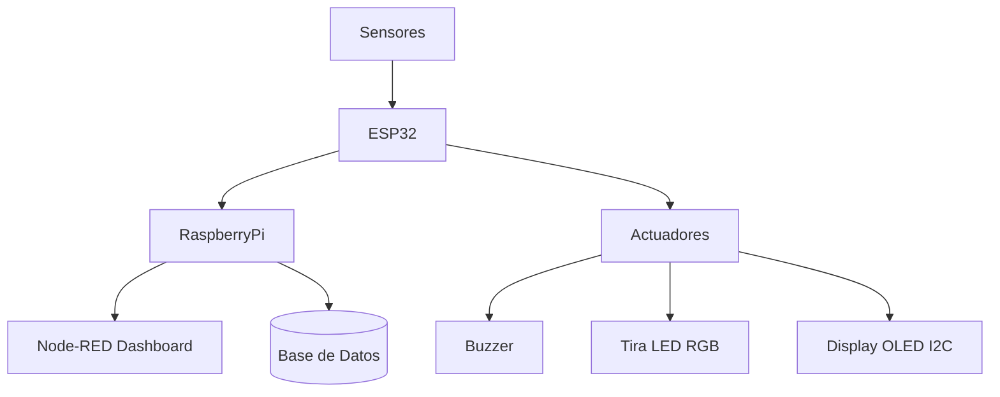

# 💡 Sistema de Iluminación Pública Inteligente

**Autores:** Josué Alejandro Esparza Padilla y Gilberto Fabián Correa González  
_Proyecto final de la materia Aplicaciones de IoT_

---

## 🌟 Características Clave

- 📡 **Detección en tiempo real** de sonido, obstáculos y presencia de gases.
- 🌦️ **Monitoreo ambiental** con sensores analógicos y digitales.
- 📊 **Visualización en Node-RED Dashboard** con gráficas, tablas y alertas.
- 📧 **Sistema de alertas MQTT** con buzzer, LED RGB y control OLED.
- 🗃️ **Registro histórico** en base de datos PostgreSQL.
- 💙 **Control remoto del buzzer** desde el panel en Node-RED.

---

## 🧱 Arquitectura del Sistema

---

## 🔧 Especificaciones Técnicas Detalladas

### ⚙️ Hardware

| Componente           | Especificaciones Técnicas                    | Ubicación en el Sistema            |
|----------------------|----------------------------------------------|------------------------------------|
| ESP32                | WiFi 802.11 b/g/n, Bluetooth 4.2             | Unidad central de control          |
| Micrófono Sensible   | Voltaje: 3.3V, Salida Analógica              | Cerca de una ventana               |
| Sensor de Obstáculo  | Infrarrojo digital, rango 2-30 cm            | Junto a la puerta                  |
| Sensor de Gas        | MQ-135, Salida digital                       | Techo de la caseta                 |
| Buzzer               | 5V, 2-4kHz                                   | Parte de arriba de la caset        |
| Tira LED RGB         | WS2812B, 10 LEDs                             | Iluminación principal              |
| Pantalla OLED        | SSD1306, I2C 128x64                          | Visualicación de alerta            |

---

## 🖥️ Dashboard en Node-RED

---

## 🛠️ Desarrollo del Prototipo

| Montaje y pruebas | Materiales usados | Cableado interno |
|------------------|-------------------|------------------|
|  | https://drive.google.com/file/d/1sHjKcKTSXX22XKSqmGwYFCTMGYzElB93/view?usp=sharing | https://drive.google.com/file/d/1FYR72bXAjQUmYC6KbE7qlxV5l1ecEUsT/view?usp=sharing | https://drive.google.com/file/d/1ZY5g-Fs7_Pl2my0fGD6A7laokcmQwGKm/view?usp=sharing | https://drive.google.com/file/d/1bIFmD7yhvmL8oTpBbJq-rjp9mR2bjAwK/view?usp=sharing |

---

## 🔎 Validación del Proyecto

🎮 **Video de validación del sistema:**  

---

## 🏆 Resultados Obtenidos

📹 **Resultados en funcionamiento:**  

---

